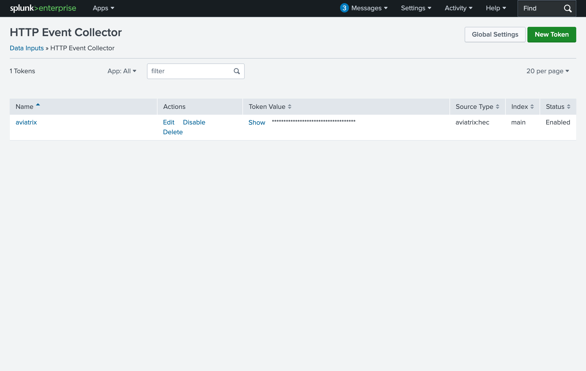
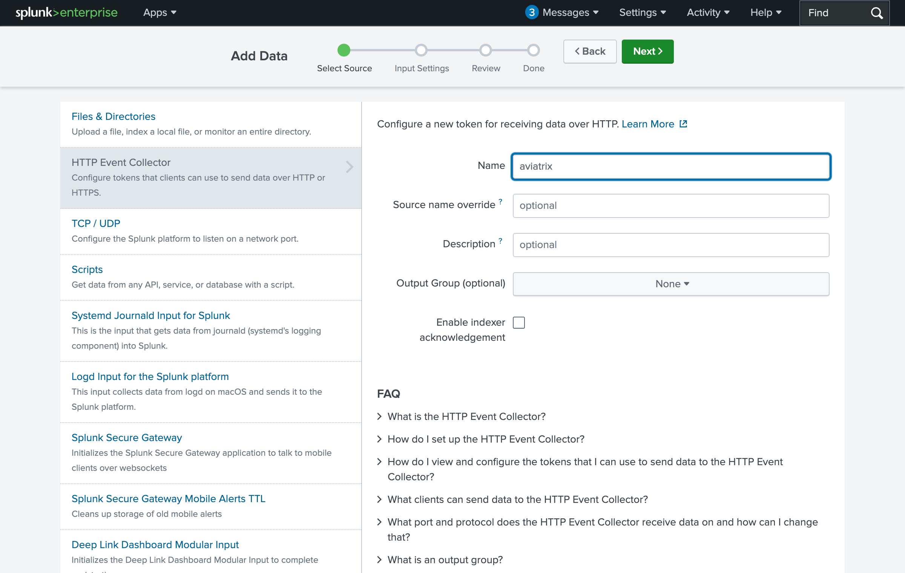
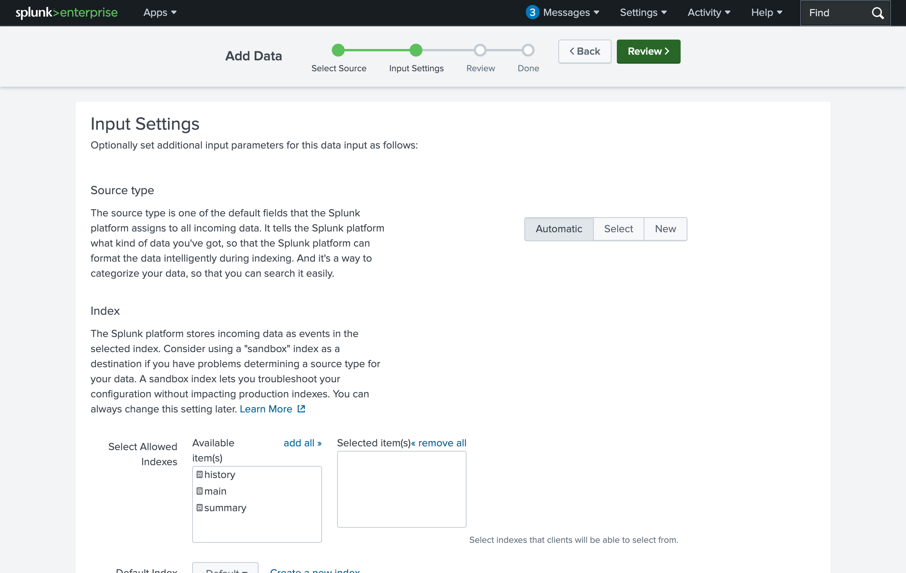
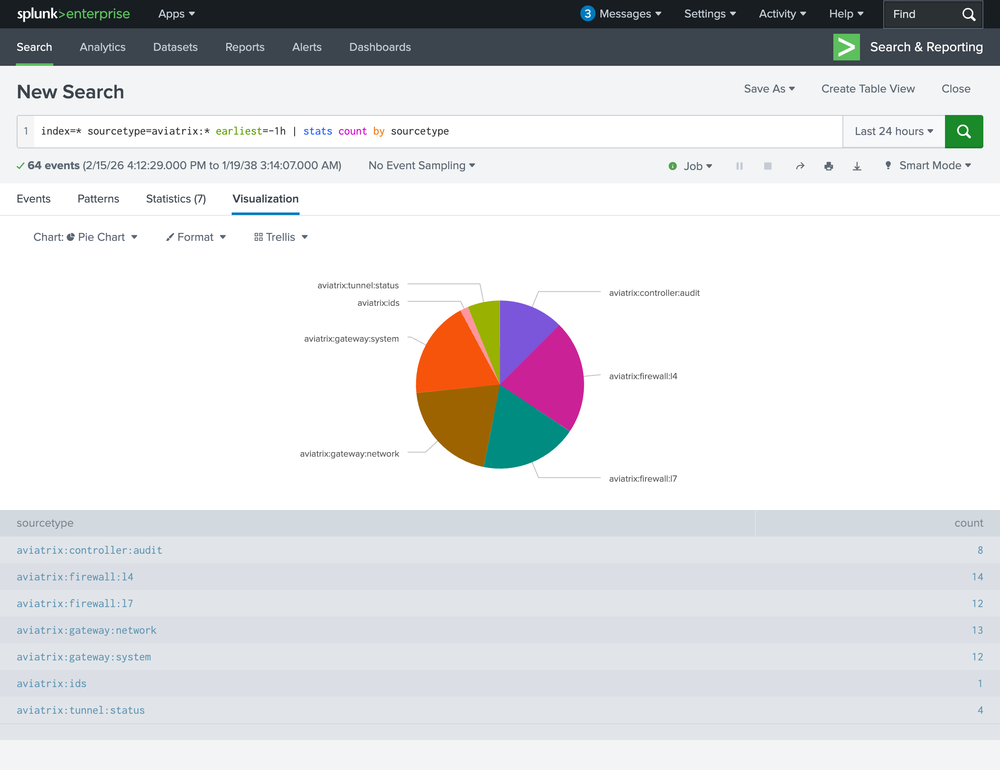

# AWS EC2 Single Instance Deployment

Deploy the Aviatrix Log Integration Engine on a single EC2 instance. Logstash receives syslog from Aviatrix gateways and forwards parsed, structured events to Splunk via HEC.

## Architecture

```
Aviatrix Gateways ──► EC2 (Logstash Docker) ──► Splunk HEC
                      syslog :5000/tcp           :8088/https
```

- **EC2 instance** (t3.small) running Logstash 8.16.2 in Docker
- **S3 bucket** stores the Logstash config and grok patterns
- **Elastic IP** provides a stable syslog endpoint
- Instance auto-replaces when configs change (zero-downtime updates)

## Prerequisites

1. **Terraform** >= 1.0 and **AWS CLI** configured with appropriate credentials
2. **SSH Key Pair** in the target AWS region
3. **VPC and Subnet** with network connectivity to your Splunk server
4. **Splunk HEC Token** -- see [Setting Up Splunk HEC](#setting-up-splunk-hec) below

## Setting Up Splunk HEC

The Log Integration Engine sends parsed events to Splunk via the HTTP Event Collector (HEC). If you don't already have HEC enabled with a token, follow these steps.

### 1. Enable HEC and Verify Global Settings

Navigate to **Settings > Data Inputs > HTTP Event Collector**. Click **Global Settings** and ensure:
- **All Tokens**: Enabled
- **Enable SSL**: Checked
- **HTTP Port Number**: 8088


### 2. Create a New Token

From the HEC token list, click **New Token**.



**Step 1 -- Select Source:** Enter a name (e.g., `aviatrix`) and click **Next**.



**Step 2 -- Input Settings:** Leave Source Type as **Automatic** (Logstash sets the sourcetype per log type). Leave the default index. Click **Review**.



**Step 3 -- Review:** Confirm settings and click **Submit**.


**Step 4 -- Done:** Copy the **Token Value** -- you'll need it for `splunk_hec_auth` in the Terraform variables.

## Quick Start

### 1. Assemble the Logstash Config

```bash
cd logstash-configs
./scripts/assemble-config.sh splunk-hec
```

This creates `assembled/splunk-hec-full.conf` and copies the Docker run template to `assembled/docker_run.tftpl`.

### 2. Configure Terraform Variables

```bash
cd deployments/aws-ec2-single-instance
cp terraform.tfvars.example terraform.tfvars
```

Edit `terraform.tfvars` with your values. At minimum, update these:

```hcl
# AWS
ssh_key_name = "my-keypair"

# Network - MUST be in the same VPC as Splunk (or have routing to reach it)
vpc_id    = "vpc-xxxxx"
subnet_id = "subnet-xxxxx"

# Splunk HEC credentials
logstash_config_variables = {
  "splunk_hec_auth" = "your-hec-token-here"
  "splunk_address"  = "https://10.x.x.x"   # Private IP of Splunk
  "splunk_port"     = "8088"
}
```

> **Tip:** Use the **private IP** of your Splunk server if it's in the same VPC. Test connectivity first:
> ```bash
> curl -k -H "Authorization: Splunk <token>" \
>   https://<splunk-ip>:8088/services/collector/event \
>   -d '{"event":"test"}'
> ```
> A `{"text":"Success","code":0}` response confirms HEC is reachable and the token is valid.

### 3. Deploy

```bash
terraform init
terraform plan -var-file=terraform.tfvars
terraform apply -var-file=terraform.tfvars
```

### 4. Get the Syslog Endpoint

```bash
terraform output
```

```
avx_syslog_destination = "18.117.20.23"
avx_syslog_port = "5000"
avx_syslog_proto = "tcp"
```

### 5. Configure Aviatrix Controller

In the Aviatrix Controller UI:
- **Settings > Logging > Remote Syslog**
- Server: `<avx_syslog_destination>` (the Elastic IP from step 4)
- Port: `5000`
- Protocol: `TCP`

## Verifying the Deployment

### Send Test Logs

Use the included test tools to send sample logs covering all 8 log types:

```bash
cd test-tools/sample-logs
./generate-current-samples.sh --overwrite   # Refresh timestamps to now
./stream-logs.py --target <syslog_ip> --tcp -v
```

### Validate in Splunk

Search for Aviatrix events in Splunk:

```spl
index=* sourcetype=aviatrix:* earliest=-1h | stats count by sourcetype
```

You should see events across all 7 sourcetypes:


### Expected Sourcetypes

| Sourcetype | Log Type | Description |
|---|---|---|
| `aviatrix:firewall:l4` | L4 Microseg | Distributed Cloud Firewall allow/deny |
| `aviatrix:firewall:l7` | L7 DCF/MITM | TLS inspection and web session logs |
| `aviatrix:firewall:fqdn` | FQDN | DNS-based firewall rules |
| `aviatrix:ids` | Suricata IDS | Intrusion detection alerts |
| `aviatrix:controller:audit` | Controller CMD | API audit trail |
| `aviatrix:gateway:network` | Gateway Net Stats | Throughput and traffic statistics |
| `aviatrix:gateway:system` | Gateway Sys Stats | CPU, memory, disk metrics |
| `aviatrix:tunnel:status` | Tunnel Status | Tunnel state changes (Up/Down) |

### Structured Field Extraction

Events arrive in Splunk with fields already extracted -- no Splunk-side transforms needed:


### Visualization

All log types visible in a single search:



## Log Profiles

Control which log types are forwarded using the `log_profile` variable:

| Profile | Log Types | Use Case |
|---|---|---|
| `all` (default) | All 8 types | Full visibility |
| `security` | suricata, mitm, microseg, fqdn, cmd | Security monitoring / SIEM |
| `networking` | gw_net_stats, gw_sys_stats, tunnel_status | Network & infrastructure monitoring |

```hcl
log_profile = "security"   # Only forward security-relevant logs
```

## Updating Configuration

1. Edit source configs in `logstash-configs/filters/` or `outputs/`
2. Reassemble: `cd logstash-configs && ./scripts/assemble-config.sh splunk-hec`
3. Apply: `cd deployments/aws-ec2-single-instance && terraform apply -var-file=terraform.tfvars`
4. The instance auto-replaces with the new config

## Troubleshooting

### Logs not reaching Splunk

1. **Check Logstash container logs:**
   ```bash
   ssh -i <key>.pem ec2-user@<instance-ip>
   sudo docker logs $(sudo docker ps -q) --tail 50
   ```

2. **Common errors:**
   | Error | Cause | Fix |
   |---|---|---|
   | `403 Invalid token` | Wrong HEC token | Update `splunk_hec_auth` in tfvars |
   | `No route to host` | Network issue | Check VPC routing / security groups |
   | `Connection refused` | HEC not enabled | Enable HEC in Splunk settings |

3. **Test HEC from the Logstash instance:**
   ```bash
   ssh -i <key>.pem ec2-user@<instance-ip>
   curl -k -H "Authorization: Splunk <token>" \
     https://<splunk-private-ip>:8088/services/collector/event \
     -d '{"event":"test from logstash instance"}'
   ```

### Config not loading

```bash
ssh -i <key>.pem ec2-user@<instance-ip>
ls -la /logstash/pipeline/    # Should contain splunk-hec-full.conf
ls -la /logstash/patterns/    # Should contain avx.conf
sudo docker ps                # Should show logstash container running
```

### Instance keeps recreating

This is expected behavior. The `lifecycle` block triggers replacement when the Logstash config or pattern file changes in S3.

## Cost

- **t3.small** (~$15/month): Recommended for < 1000 events/sec
- **t3.medium** (~$30/month): For higher throughput
- **Storage**: 30GB gp3 root volume

## Security Considerations

- The security group allows `0.0.0.0/0` on port 5000 by default -- restrict to your Aviatrix gateway CIDRs in production
- Splunk HEC token is passed as a Docker environment variable
- SSL verification is disabled for Splunk HEC (`ssl_verification_mode => "none"`) -- use proper certificates in production

## Terraform Reference

### Inputs

| Variable | Default | Required | Description |
|---|---|---|---|
| `vpc_id` | - | **Yes** | VPC with connectivity to Splunk |
| `subnet_id` | - | **Yes** | Subnet for the EC2 instance |
| `ssh_key_name` | `logstash` | No | AWS key pair name |
| `logstash_config_variables` | (defaults) | **Yes** | Splunk HEC token, address, port |
| `aws_region` | `us-east-2` | No | AWS region |
| `logstash_instance_size` | `t3.small` | No | EC2 instance type |
| `syslog_port` | `5000` | No | Syslog listener port |
| `syslog_protocol` | `tcp` | No | `tcp` or `udp` |
| `log_profile` | `all` | No | `all`, `security`, or `networking` |
| `tags` | `{"App":"avx-log-integration"}` | No | Resource tags |

### Outputs

| Output | Description |
|---|---|
| `avx_syslog_destination` | Elastic IP for syslog endpoint |
| `avx_syslog_port` | Syslog port |
| `avx_syslog_proto` | Syslog protocol |

### Files

| File | Purpose |
|---|---|
| `main.tf` | EC2 instance, S3 bucket, IAM, security group, networking |
| `variables.tf` | Variable definitions with defaults |
| `output.tf` | Terraform outputs |
| `terraform.tfvars.example` | Example configuration (copy to `terraform.tfvars`) |
| `logstash_instance_init.tftpl` | EC2 user data bootstrap script |
