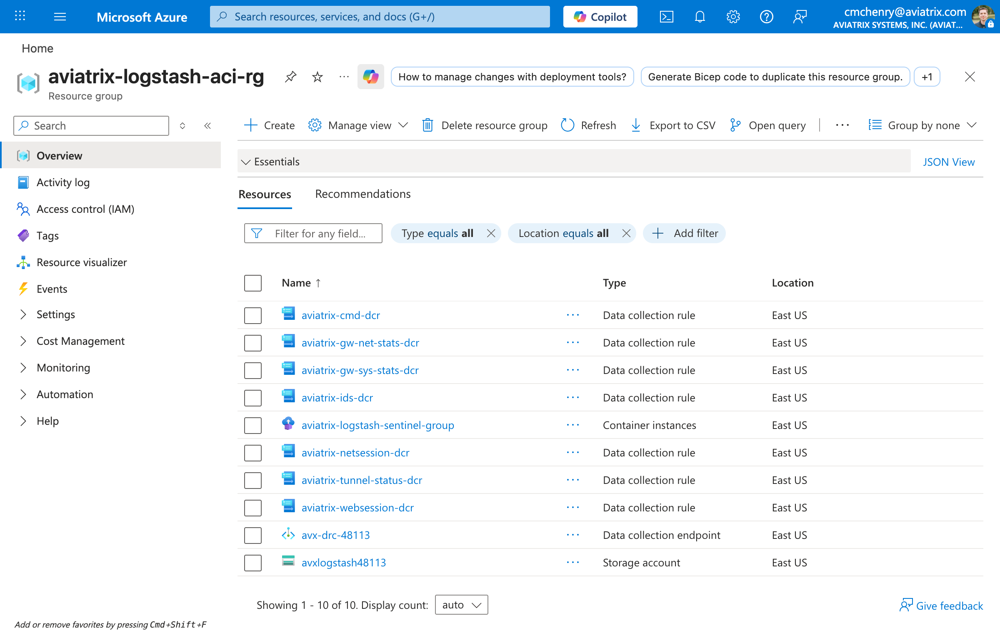

# Azure Container Instances (ACI) Logstash Deployment

Terraform deployment for the Aviatrix SIEM Connector on Azure Container Instances. Receives syslog from Aviatrix gateways/controllers and forwards parsed, ASIM-normalized events to Azure Log Analytics via the Microsoft Log Ingestion API.

> For background on connecting Logstash to Microsoft Sentinel using Data Collection Rules, see the [Microsoft Learn article](https://learn.microsoft.com/en-us/azure/sentinel/connect-logstash-data-connection-rules).

## Architecture

```
Aviatrix Gateways/Controllers
         |
         v (syslog TCP or UDP 5000)
  Azure Container Instance (Logstash)
         |
         v (Log Ingestion API)
  Data Collection Rules (7 DCRs)
         |
         v
  Azure Log Analytics (7 custom tables)
         |
         v
  Microsoft Sentinel (ASIM parsers)
```

> **ACI protocol limitation**: Azure Container Instances can expose only one protocol (TCP or UDP) per port. This deployment defaults to **TCP**, which is recommended for syslog reliability. Set `container_protocol = "UDP"` in tfvars if your gateways use UDP. You cannot expose both TCP and UDP on port 5000 simultaneously.

## What Terraform Creates

| # | Resource | Description |
|---|----------|-------------|
| 1 | Resource Group | Container and all child resources |
| 2 | Storage Account + 2 File Shares | Pipeline config (`logstash.conf`) and patterns (`avx.conf`) |
| 3 | Container Group | Logstash container with file share mounts |
| 4 | Data Collection Endpoint | Log Ingestion API endpoint |
| 5 | 7 Custom Tables | ASIM-normalized + operational tables in Log Analytics |
| 6 | 7 Data Collection Rules | One per table, pass-through KQL transform |
| 7 | Service Principal (optional) | Created only when `use_existing_spn = false` |
| 8 | 7 Role Assignments | SPN "Monitoring Metrics Publisher" on each DCR |



### Tables Created

| Table | Log Type | ASIM Schema |
|-------|----------|-------------|
| `AviatrixNetworkSession_CL` | L4 Microsegmentation | NetworkSession (v0.2.7) |
| `AviatrixWebSession_CL` | L7 MITM/TLS Inspection | WebSession (v0.2.7) |
| `AviatrixIDS_CL` | Suricata IDS | NetworkSession, EventType=IDS |
| `AviatrixGwNetStats_CL` | Gateway Network Stats | (none) |
| `AviatrixGwSysStats_CL` | Gateway System Stats | (none) |
| `AviatrixCmd_CL` | Controller CMD/API | (none) |
| `AviatrixTunnelStatus_CL` | Tunnel Status Changes | (none) |

> **Note**: FQDN firewall events are parsed by Logstash but do not have an Azure output. Only 7 of the 8 log types are forwarded to Log Analytics.

## Prerequisites

1. **Azure CLI** installed and authenticated
   - Public: `az cloud set --name AzureCloud && az login`
   - China: `az cloud set --name AzureChinaCloud && az login`

2. **Terraform** >= 1.0

3. **Log Analytics Workspace** — must already exist. Provide its name and resource group via variables. If it's in a different subscription, set `log_analytics_subscription_id`.

4. **Container Image** with the Microsoft Sentinel Logstash output plugin installed. See [Container Image](#container-image) below.

5. **Entra ID Service Principal** (one of):
   - **Pre-created** (default, `use_existing_spn = true`): provide `client_app_id`, `client_app_secret`, `tenant_id` in tfvars
   - **Auto-created** (`use_existing_spn = false`): requires "Application Administrator" or "Cloud Application Administrator" Entra ID role

6. **Assembled Logstash config**:
   ```bash
   cd logstash-configs
   ./scripts/assemble-config.sh azure-log-ingestion
   ```

## Container Image

The Logstash container requires the [Microsoft Sentinel output plugin](https://github.com/Azure/Azure-Sentinel/tree/master/DataConnectors/microsoft-sentinel-log-analytics-logstash-output-plugin) pre-installed. The stock Elastic image does not include it.

> In the future, Aviatrix plans to publish an official container image on GitHub Container Registry (ghcr.io). Until then, build your own using the instructions below.

### Building the Container Image

A Dockerfile and build script are provided in [`logstash-container-build/`](logstash-container-build/):

```dockerfile
FROM docker.elastic.co/logstash/logstash:8.16.2
RUN logstash-plugin install microsoft-sentinel-log-analytics-logstash-output-plugin
```

**Option A: Interactive build script**
```bash
cd deployments/azure-aci/logstash-container-build
./build-and-push.sh
```
This creates the ACR (if needed), builds the image, and pushes it.

**Option B: Manual steps**
```bash
# Set variables
export ACR_NAME="yourregistryname"
export RESOURCE_GROUP="your-acr-rg"
export IMAGE="aviatrix-logstash-sentinel:latest"

# Create ACR (if needed)
az group create --name $RESOURCE_GROUP --location eastus
az acr create --resource-group $RESOURCE_GROUP --name $ACR_NAME --sku Standard
az acr update --name $ACR_NAME --anonymous-pull-enabled true

# Build and push
az acr login --name $ACR_NAME
az acr build --registry $ACR_NAME --image $IMAGE \
  --file deployments/azure-aci/logstash-container-build/Dockerfile \
  deployments/azure-aci/logstash-container-build/
```

After building, set `container_image` in your `terraform.tfvars`:
```hcl
container_image = "yourregistryname.azurecr.io/aviatrix-logstash-sentinel:latest"
```

See [`logstash-container-build/README.md`](logstash-container-build/README.md) for Azure China instructions.

## Deployment

### Azure Public or China

| Cloud | Folder |
|-------|--------|
| Public | `deploy-public/` |
| China | `deploy-china/` |

### Steps

```bash
# 1. Assemble the Logstash config
cd logstash-configs
./scripts/assemble-config.sh azure-log-ingestion

# 2. Deploy
cd deployments/azure-aci/deploy-public  # or deploy-china
cp terraform.tfvars.sample terraform.tfvars
# Edit terraform.tfvars with your values

# 3. Validate, plan, apply
../scripts/validate-deployment.sh
terraform init
terraform plan
terraform apply
```

### Key Variables

| Variable | Description |
|----------|-------------|
| `container_image` | Full image path (e.g., `yourregistry.azurecr.io/aviatrix-logstash-sentinel:latest`) |
| `container_protocol` | `TCP` (default, recommended) or `UDP` — must match Aviatrix syslog config |
| `log_analytics_workspace_name` | Existing Log Analytics workspace name |
| `log_analytics_resource_group_name` | Resource group of the workspace |
| `log_analytics_subscription_id` | Workspace subscription (if different from deployment) |
| `use_existing_spn` | `true` to provide existing SPN credentials, `false` to auto-create |
| `client_app_id` / `client_app_secret` / `tenant_id` | SPN credentials (when `use_existing_spn = true`) |
| `azure_cloud` | `AzureCloud`, `AzureChinaCloud`, or `AzureUSGovernment` |

> Stream names (`azure_stream_*`) and DCR IDs (`azure_dcr_*_id`) are injected automatically by the module. Do not set them in `terraform.tfvars` or `environment_variables`.

### Post-Deployment Checklist

After `terraform apply` completes, verify:

- [ ] Resource group exists with all child resources
- [ ] Container group is running (`az container show --resource-group <your-rg> --name <container>-group --query provisioningState`)
- [ ] 7 custom tables visible in Log Analytics workspace
- [ ] 7 DCRs created in the resource group
- [ ] SPN has "Monitoring Metrics Publisher" role on each DCR
- [ ] Container logs show Logstash startup (`az container logs --resource-group <your-rg> --name <container>-group | tail -20`)

## Aviatrix Log Export Configuration

Configure Aviatrix Copilot to export logs to the deployed container:

1. Log in to Aviatrix Copilot
2. Go to **Settings > Configuration > Logging services > Edit Profile** under Remote Syslog
3. Configure:
   - **Server**: Use the `container_group_fqdn` output from Terraform
   - **Port**: `5000`
   - **Protocol**: Match `container_protocol` (TCP or UDP)
4. Save

See the [Aviatrix Copilot logging documentation](https://docs.aviatrix.com/documentation/latest/platform-administration/copilot/aviatrix-logging-copilot.html#syslog-profiles) for details.

## ASIM Parser Deployment (Optional)

Three KQL ASIM parser files are provided for Sentinel integration in [`logstash-configs/outputs/azure-log-ingestion/asim-parsers/`](../../logstash-configs/outputs/azure-log-ingestion/asim-parsers/):

| Parser | Schema | Table |
|--------|--------|-------|
| `vimNetworkSessionAviatrixGateway.kql` | NetworkSession | `AviatrixNetworkSession_CL` |
| `vimWebSessionAviatrixGateway.kql` | WebSession | `AviatrixWebSession_CL` |
| `vimNetworkSessionAviatrixSuricata.kql` | NetworkSession (IDS) | `AviatrixIDS_CL` |

Deploy each parser as a saved function in your Log Analytics workspace. See the deployment instructions at the top of each `.kql` file.

Once deployed, the parsers integrate with Sentinel's ASIM framework (`_Im_NetworkSession`, `_Im_WebSession`), enabling cross-vendor correlation and ASIM-based analytics rules.

## Updating Configuration

If you modify filters, patterns, or the output config:

```bash
# Reassemble
cd logstash-configs
./scripts/assemble-config.sh azure-log-ingestion

# Re-deploy (updates the file share, container auto-reloads)
cd deployments/azure-aci/deploy-public
terraform apply
```

The container has `CONFIG_RELOAD_AUTOMATIC=true`, so Logstash detects file changes and reloads without restart.

## Testing Without Live Aviatrix Gateways

Test tools are provided in `test-tools/sample-logs/` to verify the deployment end-to-end without requiring live Aviatrix infrastructure.

### 1. Refresh Test Sample Timestamps

The sample logs have hardcoded timestamps that need to be updated to the current time window (otherwise Log Analytics will reject them or they'll appear as stale data):

```bash
cd test-tools/sample-logs
./generate-current-samples.sh --overwrite
```

### 2. Stream Test Logs

Send the 44 sample log lines (covering all 8 log types) to the deployed container:

```bash
# Get the container FQDN from Terraform output
cd deployments/azure-aci/deploy-public
FQDN=$(terraform output -raw container_group_fqdn)

# Stream all test samples
cd test-tools/sample-logs
./stream-logs.py --target $FQDN --tcp -v --delay 0.5
```

Useful options:
```bash
./stream-logs.py --list-types              # Show available log type filters
./stream-logs.py --filter microseg -v      # Send only microseg logs
./stream-logs.py --loop --delay 1          # Continuous replay
```

### 3. Verify in Log Analytics

Wait 5-10 minutes for ingestion latency, then query each table. Use the workspace ID from your Log Analytics workspace.

```bash
WORKSPACE_ID=$(az monitor log-analytics workspace show \
  --resource-group <your-la-rg> --workspace-name <your-la-workspace> \
  --query customerId -o tsv)

# Check ASIM fields on security tables
az monitor log-analytics query --workspace $WORKSPACE_ID \
  --analytics-query "AviatrixNetworkSession_CL | project TimeGenerated, EventVendor, EventSchema, DvcAction, SrcIpAddr, DstIpAddr | take 5"

az monitor log-analytics query --workspace $WORKSPACE_ID \
  --analytics-query "AviatrixWebSession_CL | project TimeGenerated, EventSchema, DstFqdn, DvcAction | take 5"

az monitor log-analytics query --workspace $WORKSPACE_ID \
  --analytics-query "AviatrixIDS_CL | project TimeGenerated, EventType, ThreatName, ThreatId, EventSeverity | take 5"
```


### Expected Results

From the 44 sample log lines, Logstash produces ~42 output events across 7 tables. FQDN events are parsed but not forwarded to Azure (no Azure output for that log type). One suricata "notice" event is dropped (alerts only).

| Table | Expected Events | Key Fields to Verify |
|-------|-----------------|----------------------|
| `AviatrixNetworkSession_CL` | ~7 | `EventSchema=NetworkSession`, `DvcAction=Allow/Deny` |
| `AviatrixWebSession_CL` | ~12 | `EventSchema=WebSession`, `DstFqdn` populated |
| `AviatrixIDS_CL` | ~1 | `EventType=IDS`, `ThreatName` populated |
| `AviatrixGwNetStats_CL` | ~7 | `total_rx_rate`, `total_tx_rate` fields |
| `AviatrixGwSysStats_CL` | ~7 | `cpu_idle`, `memory_free` fields |
| `AviatrixCmd_CL` | ~4 | `action`, `username` fields |
| `AviatrixTunnelStatus_CL` | ~4 | `src_gw`, `dst_gw`, `new_state` fields |

### 4. Check Container Logs for Errors

```bash
# View recent logs (replace with your actual resource group and container names)
RG=$(terraform output -raw resource_group_name)
CONTAINER=$(terraform output -raw container_group_name)

az container logs --resource-group $RG --name $CONTAINER | tail -20

# Check for successful posts
az container logs --resource-group $RG --name $CONTAINER | grep "Successfully posted"
```

## Clean Up

```bash
terraform destroy
```

This removes all resources created by Terraform. The Log Analytics workspace (a prerequisite, not created by Terraform) is not affected. The ACR and container image (built separately) are also not affected.

## Troubleshooting

### Attach to Container Logs

```bash
RG=$(terraform output -raw resource_group_name)
CONTAINER=$(terraform output -raw container_group_name)
az container attach --resource-group $RG --name $CONTAINER
```

### Query Log Analytics

```kql
AviatrixNetworkSession_CL | take 10
AviatrixWebSession_CL | take 10
AviatrixIDS_CL | take 10
```

### Common Issues

- **Plugin not found**: Ensure you're using the custom container image with the Sentinel plugin, not the stock Elastic image.
- **Config file not updating**: If `terraform apply` doesn't detect the file change, taint and re-apply: `terraform taint 'module.deployment.azurerm_storage_share_file.logstash_conf'`
- **DCR ingestion errors**: Check that the SPN has "Monitoring Metrics Publisher" role on all DCRs. Verify with: `az role assignment list --assignee <spn-object-id> --scope <dcr-id>`
- **No data in tables**: Verify the container is running and receiving syslog. Check `az container logs` for errors. Ensure timestamps in test data are within the last 24 hours (run `generate-current-samples.sh --overwrite` to refresh).
- **FQDN events missing**: This is expected — FQDN events are parsed but not forwarded to Azure. Only 7 of the 8 log types have Azure outputs.
